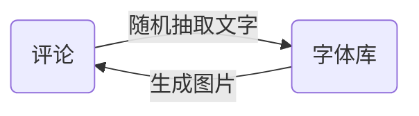

# 大众点评评论爬取

### 一、简介

网址：[http://www.dianping.com/shop/G41gaJfqGBICtiVY](http://www.dianping.com/shop/G41gaJfqGBICtiVY)

效果：**爬取评论**

使用框架：**selenium、requests、re**

难度系数：**✩✩✩✩✩**

### 引言

> 大众点评的反爬措施一直都是响当当的，最近由于作业需要，需要来碰一碰这个霉头。没办法，只能硬着头皮上了。
> 经过一上午的艰难分析终于实现了整个过程。整个分析过程犹如玩了一场紧张刺激的密室逃生。
### 二、教程

#### 1. 网站分析

##### 评论分析

本次爬虫选取的是四川成都的一家餐厅：[饕林餐厅(春熙路店)](http://www.dianping.com/shop/G41gaJfqGBICtiVY)


**查看完整评论时发现需要登陆**

**查看更多评论时发现也需要登陆**
**结论:**
经过简单分析后发现想要爬取评论的话是必须要登录的了。

**登录后再对页面进行分析**

审查页面元素发现展开完整评论是触发了一个点击事件
利用浏览器抓包发现评论的数据是在页面初始化时拿到的数据，展开数据发现

查看数据发现评论部分文字被 **\<svgmtsi class="review"></svgmtsi>** 替换

但是发现数据包的请求链接比较复杂，猜测应该是通过js加密构造的
查看更多网页发现链接参数可以构造：
- **第1页**[http://www.dianping.com/shop/G41gaJfqGBICtiVY/review_all/p1](http://www.dianping.com/shop/G41gaJfqGBICtiVY/review_all/p1)
- **第2页**[http://www.dianping.com/shop/G41gaJfqGBICtiVY/review_all/p2](http://www.dianping.com/shop/G41gaJfqGBICtiVY/review_all/p2)
- **第3页**[http://www.dianping.com/shop/G41gaJfqGBICtiVY/review_all/p3](http://www.dianping.com/shop/G41gaJfqGBICtiVY/review_all/p3)

##### 结论

经过初步分析，发现爬取大众点评用户评论有三个难点：
1. 查看完整评论和更多评论需要登陆后才可以
2. 评论数据包的链接比较复杂，需要研究页面js代码
3. 评论数据不完整，部分文字被替换


### 2. Selenium自动化登陆

基于初步分析遇到的困难，决定采用Selenium调用浏览器采取手动登陆的方式来解决前两个问题：

```python
import time
import random
from selenium import webdriver

url = 'http://www.dianping.com/shop/G41gaJfqGBICtiVY/review_all/p{}'
driver = webdriver.Firefox(executable_path=r'geckodriver.exe')
driver.get(url.format(1))

time.sleep(30)    # 暂停30s,在这个时间内进行登陆操作

# 这里选择只爬取三页数据
for i in range(1, 3):
    driver.get(url.format(i))
    time.sleep(random.randint(5, 10))
    driver.find_element_by_class_name('fold').click() # 发送点击事件展开评论
    time.sleep(2)
	# 将渲染后的网页保存为文件，就不用多次运行爬虫了
    with open('html/p%d.html'%i, 'w', encoding='utf-8') as f:
        f.write(driver.page_source)

driver.close()
```
### 3.  揭秘CSS反爬

剩下最后一个问题就是解决评论中部分内容被替换的问题。
##### 分析CSS加密过程

审查页面元素，发现被替换部分的一些 CSS信息，在这里我们发现了一个**backgroung-image**

打开这个链接发现是一个svg文件，里面有许多文字，搜索发现在页面中有着被替换的文字，并且在审查元素时发现页面有两个特殊的值——**x和y**

先会儿在审查原来页面的时候也发现了**x和y值**，这个时候需要怀疑这两个部分之间是否会有关联。

通过分析类似元素找到规律：
**页面x值 / 14px(字体宽度) = 字体库中的文字所在行的位置(从0开始数)**
**页面y值 + 23px = 字体库中的文字所在行的y**
##### 加密过程



##### 代码

CSS加密过程既然已经了解了，那么我们就可以开始解密了：

```python
import re
import requests

# 加载html文件内容
with open('html/p1.html', 'r', encoding='utf-8') as f:
    html = f.read()

# 获取css文件
css = re.findall('<link rel="stylesheet" type="text/css" href="(.*?)">', html, re.S)
css_url = 'http:{}'.format(css[1])
css_content = requests.get(css_url).text
with open('css/css.css', 'w', encoding='utf-8') as f:
    f.write(css_content)

# 获取字库
font = re.findall('background-image: url\((.*?)\);', css_content, re.S)
font_url = 'http:{}'.format(font[1])
font_content = requests.get(font_url).text
with open('font/font.swg', 'w', encoding='utf-8') as f:
    f.write(font_content)


# 获取信息
for i in range(1, 3):
    with open('html/p{}.html'.format(i), 'r', encoding='utf-8') as f:
        html = f.read()

    inf = re.findall('<div class="review-words(.*?)<div class="less-words">', html, re.S)
    for record in inf:
        inf_copy = record
        svgmti = re.findall('<svgmtsi class="(.*?)">', record)
        for class_name in svgmti:
            XY = re.findall('.%s{background:-(.*?)px -(.*?)px;}'%class_name, css_content, re.S)
            X = int(float(XY[0][0])/14)    # 被替换的文字X坐标换算为字体库的X
            Y = int(float(XY[0][1]) + 23)  # 被替换的文字Y坐标换算为字体库的Y
            fo = re.findall('<text x="0" y="%s">(.*?)</text>'%Y, font_content)
            inf_copy = re.sub(f'<svgmtsi class="{class_name}"></svgmtsi>', fo[0][X], inf_copy, count=0)

        # 删除干扰字符
        inf_copy = re.sub('', '', inf_copy, count=0)
        inf_copy = re.sub('</div>.*?<div class="review-words', '', inf_copy, count=0, flags=re.S)
        inf_copy = inf_copy.replace('Hide">', '')
        inf_copy = inf_copy.replace('">', '')
        inf_copy = inf_copy.replace('\n', '')
        inf_copy = inf_copy.replace(' ', '')
        inf_copy = inf_copy.strip()
        print(inf_copy)
```

##### 结语

在反反爬虫的过程中，一定要细致，每一个细节都可能成为破译的关键。
**PS：爬虫虽好，可不要贪杯哦，小心面向监狱编程哦😂**


##### 4. 完整代码

如果觉得有帮助，请为博主点一个小小的 <p>star ✩</p>吧，你的鼓励是博主最大的动力！
[传送门]([https://github.com/1314liuwei/python_spider/blob/master/No.2%20%E5%A4%A7%E4%BC%97%E7%82%B9%E8%AF%84%E8%AF%84%E8%AE%BA%E7%88%AC%E5%8F%96/main.py](https://github.com/1314liuwei/python_spider/blob/master/No.2 大众点评评论爬取/main.py))

[](https://imgchr.com/i/Uxuoss)