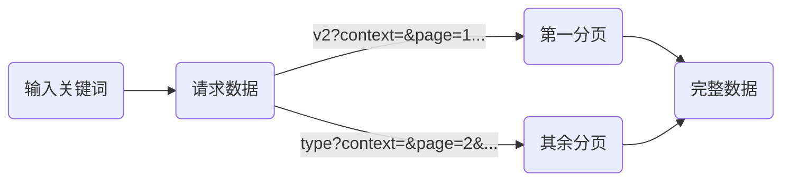

# B站搜索结果链接爬取

### 一、简介

网址：[https://search.bilibili.com](https://search.bilibili.com)

效果：**链接**

使用框架：**requests、json**

难度系数：**✩✩**

## 二、教程

今天我们就要对我们的小破站下手了，嘿嘿


#### 1. 网站分析


随便搜索一个关键词，审查源代码，可以发现数据在网页源码里面都有。

那么可以采取和爬取豆瓣Top250一样的思路：下载网页，提取信息。

ok，今天的教程到此结束

别急别急，上面那种思路太常规了，今天我们采取一种更加**高档、优雅**的方法~

回到搜索页面，谷歌浏览器使用快捷键**Ctrl+Shift+I**或者在网页内右键检查进入调试界面，找到**Network**，


然后再刷新网页，我们会发现多了很多东西


在一个以 **v2?context=&page=1...** 开头的请求中，我们在 **Preview** 里发现了一些有趣的东西：


这些数据之所以有趣，是因为它们和我们页面中看到的数据是有着关联的：


答案已经揭晓了，页面中呈现给我们的数据都是通过拿这个请求中的数据展示给我们的。既然人家都把数据整整齐齐的排整好了，我们直接请求这个链接拿数据不就好了吗😁

别慌，我们还要再验证一番，看看其它分页和其它搜索关键词是否也是这种模式的：


在点击进入第二页是，我们发现请求的链接发生了改变，不再是以 **v2?context=&page=1...** 开头的链接了，而变成了以**type?context=&page=2&...** 开头的链接。

经过多次分析发现不同搜索关键词的第一分页的数据请求都是以 **v2?context=&page=1...** 开头，其余分页的请求都是以**type?context=&page=2&... **开头。

#### 2. 爬虫思路



#### 3. 构造爬虫

在实际操作爬虫的过程中，会发现 **headers** 中仅仅加入一个 **User-Agent** ，是获取不到数据的。

经过尝试，发现还要加入一个 **Referer** 才可以爬取到数据，该参数的作用是告诉服务器，这个请求是从哪个链接过来的。

更改后的 **headers**：

```python
headers = {
        'User-Agent': "Mozilla/5.0 (Windows NT 10.0; Win64; x64) AppleWebKit/537.36 (KHTML, like Gecko) "
                      "Chrome/84.0.4147.89 Safari/537.36",
        'Referer': "https://search.bilibili.com"
    }
```

请求到数据后我们通过可以通过 **json** 模块将数据 **转化为Python的字典对象**，由于请求得到的内容非标准json格式，我们需要去掉首位冗余字符串后再进行格式转换，否则程序会抛出格式错误的异常:

```python
import json
import requests

url = "https://api.bilibili.com/x/web-interface/search/all/v2?context=&page=1&order=&keyword=%E7%BA%A6%E4%BC%9A%E5%A4%A7%E4%BD%9C%E6%88%98&duration=&tids_1=&tids_2=&__refresh__=true&_extra=&highlight=1&single_column=0&jsonp=jsonp&callback=__jp2"

headers = {
        'User-Agent': "Mozilla/5.0 (Windows NT 10.0; Win64; x64) AppleWebKit/537.36 (KHTML, like Gecko) "
                      "Chrome/84.0.4147.89 Safari/537.36",
        'Referer': "https://search.bilibili.com"
    }

response = requests.get(url=url, headers=headers).text
data = json.loads(response[6:len(response) - 1])  # 去掉首尾多余字符串
```

#### 4. 完整代码
[传送门]([[https://github.com/1314liuwei/python_spider/blob/master/No.3%20B%E7%AB%99%E6%90%9C%E7%B4%A2%E7%BB%93%E6%9E%9C%E9%93%BE%E6%8E%A5%E7%88%AC%E5%8F%96/main.py](https://github.com/1314liuwei/python_spider/blob/master/No.3 B站搜索结果链接爬取/main.py))
